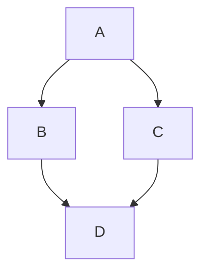
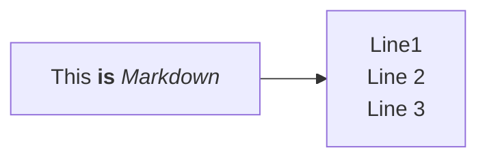

# 組み込み講座メモ

・エクスプローラー  
    標準ファイル管理ツール  
・フェッチ  
    メモリやリモート先からデータ・命令を読み出す動作

## 時間

0900-12:00,13:00-18:00

## 本日の学習項目

・オリエンテーション
・gitのインストール

- x
- y
- z

## URL/Memo

こんにちは  
こんばんは

## 感想/質問/その他(振り返り)

今日から研修が始まった。  想像していたよりも自身の機械音痴加減に辟易としていたが、研修担当の皆さんの支えもあり、gitのダウンロードを終えた。  
なれない作業ばかりであるが、少しずつ覚えていきたい。

## 残作業(あれば)
