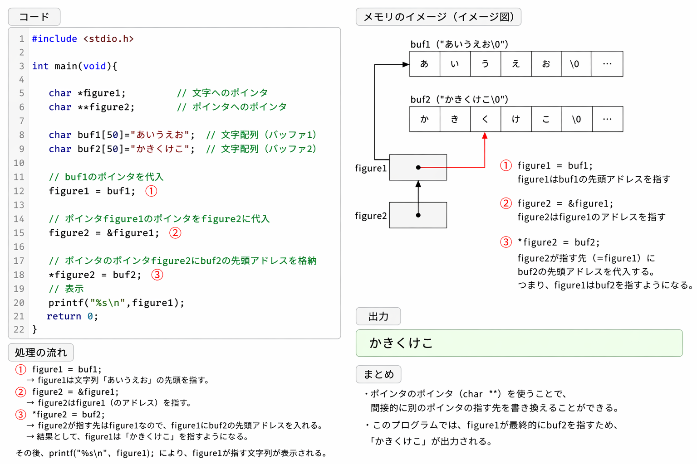

# 組み込み講座メモ

アドレス:変数やデータの場所を示す番号
ポインタ:ある変数のアドレスを格納する変数
*つける意図
キャラクターのアドレスを確認できるようにするため

=:代入の意味
==:右辺と左辺が同じという意味。
!=:ノット≓

## 時間

0900-12:00,13:00-18:00

## 本日の学習項目

- アドレス、ポインタ、ポインタのポインタ
- 100本ノック
- z

## URL/Memo

[URL](https://eetimes.itmedia.co.jp/ee/articles/2604/22/news035.html)

## 感想/質問/その他(振り返り)

ついに大きめの壁とぶつかった感覚がある。[https://saycon.co.jp/archives/neta/c-lang]
10章の部分がしばらく壁となるだろう。
100本ノックもおそらくその単元で一旦止まってしまった。。無念。
しっかり復習を行おう。

## 残作業(あれば)
