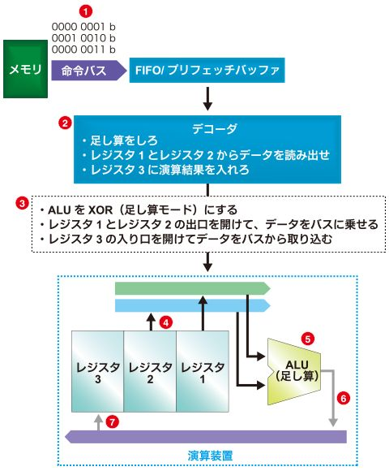

# 組み込み講座メモ

昨日はボタンのまとめまで

- マイコンの起源は、電卓用のICでした。高性能な電卓をいかに少ない部品で作るかという課題に取り組む中で開発が進み、発展しました。

汎用レジスタとアキュムレータ
　マイコンなどのデジタル回路において、フリップフロップなどの回路を用いてデータを保持する回路のことを一般にレジスタと呼んでいます。メモリもデータを保持するのに使われますが、比較的小さい容量の記憶回路をレジスタと呼びます。CPUの中にあって、演算データを一時的に保管する複数のレジスタを「汎用レジスタ」と呼んでいます。一方、周辺機能（タイマ、USART､ADコンバータなど）の設定値や測定結果を格納するレジスタは「周辺レジスタ」などとされています（呼び方は、各マイコンで異なります）。STマイクロエレクトロニクス（以下ST）のSTM32などで搭載しているARM社のCortex-M3は、汎用レジスタ方式です。

　アキュムレータも汎用レジスタと同じく、データを保持する回路です。汎用レジスタの場合は複数のレジスタがあり、ALU（Arithmetic and Logic Unit）などを介してレジスタ間の演算ができますが、アキュムレータは１つしかなく、演算は必ずアキュムレータとメモリ間で行います。そして演算結果は、アキュムレータに入ります（マイコンによってはメモリにも入ります）。アキュムレータは英語でaccumulatorと書きます。意味は、「蓄積する人（物）」、「累算器」、「積算器」、「加算器」です。

　演算結果が必ずアキュムレータに入るので、足し算を繰り返すと、演算結果が順次累積されるので、この名前が使われるようになりました。汎用レジスタ方式に比べ、回路が簡単になるというメリットがあります。

　最近では、汎用レジスタ方式がほとんどのマイコンで採用されていますが、STのSTM8シリーズはアキュムレータ方式で高性能を実現している代表的なマイコンと言えます。

## CPUのブロック図

CPUのブロック図の例を図1と図2に示します。イメージをつかみやすいように、CPU の大まかな要素だけ書き出しています。汎用レジスタ方式とアキュムレータ方式では演算装置（Execution Unit）の内部構成が異なるだけで、その他の構成要素は同じです。違いが分かりやすいように上下に並べて掲載しました。
図1

図2

メモリ（ROM）から読み出された命令コードは一度「FIFO」（プリフェッチバッファ）に格納されます。

- FIFOとは、First In First Outの頭文字です。読み方は人によって異なり、ファイフォー、フィーフォーなどと読まれることが多いようです。日本語にすると「先入れ先出し」ですが、あまり日本語で使われることはありません。最初に入ってきたものを順番に処理する方式のバッファメモリ（一時的にデータを保管するメモリ）です。

- プリフェッチバッファのプリフェッチ（pre-fetch）とは、日本語で「事前読み込み/読み出し」です。データを前もって読み出しておき、保管しておくバッファメモリです。高速なメモリを使用して、演算性能の向上を目的としています。

- デコーダとは、命令を解読する機能です。FIFOから命令を順番に読み出して、何の命令か判別します。そして、その命令の機能に従って、演算装置に命令を出します。

- 演算装置（Execution Unit）はその名の通り、演算を行う装置です。この装置には汎用レジスタまたはアキュムレータとALUやシフタなどの演算機能が入っています。なお、ALUは算術演算、論理演算を受け持ち、シフタはデータをシフトする（ずらす）操作やローテート（循環）する操作に使う機能を果たします。

## 演算の流れ

## map関数

ある範囲から別の範囲へ番号を再マッピングします。つまり、fromLowの値はtoLowに、fromHighからtoHighへの値、その間の値がその間の値にマッピングされる、という動作です。

値は範囲内に限定されません。なぜなら、範囲外の値は意図され有用だからです。この関数は、範囲に制限がある場合、この関数の前後に使用できます 望まれている。constrain()

いずれの範囲の「下限」も「上限」より大きくも小さい場合もあるので、例えば数の範囲を逆にするために使われることもありますmap()

y = map(x, 1, 50, 50, 1);

この関数は負の数もよく扱うため、以下の例も有効でよく機能します。

y = map(x, 1, 50, 50, -100);

この関数は整数計算を用いるため、分数を生成すべきだと示している場合に分数は生成しません。分数余りは切り詰められ、丸めたり平均化されたりしません。map()

- チャタリング

チャタリングとは、様々な要素で発生する、電気信号の「ばたつき」を意味します。
「接点」の動作（接続・切断）は、一瞬で動作後、止まっているように思えますが、実際には
・動作環境（速度圧力など）
・バネのバウンドや振動
・接点の種類や形状
・劣化、形状劣化
など様々な影響で「チャタリング」は、必ず発生しています
[出典元](https://pochiweb.com/%e3%83%81%e3%83%a3%e3%82%bf%e3%83%aa%e3%83%b3%e3%82%b0%e3%81%a8%e3%81%af%ef%bc%9f%ef%bc%88%e5%88%9d%e5%bf%83%e8%80%85%e5%90%91%e3%81%91%ef%bc%89%e5%9f%ba%e6%9c%ac%e7%9a%84%e3%81%ab%e3%80%81%e3%82%8f/)

- プルダウン抵抗
プルアップ（プルダウン）抵抗とは、電子回路における「浮いている」状態を避けるための抵抗です。マイコンの入力端子は、必ず電圧源、グランド、グランド基準信号源に接続しなければならず「浮いている」状態を極力避ける鉄則があります。
プルアップではボタンが押されていない時にONとなりますが、抵抗を下側に配置するとボタンを押した時にONになるプルダウンになります。
この回路は、スイッチをONにしている時であれば問題ありません。
しかし、スイッチOFFの状態にすると、マイコンの入力端子が何も繋がっていない「浮いている」状態になります。
[出典元](https://voltechno.com/blog/pullup-pulldown/)

## 時間

0900-12:00,13:00-18:00

## 本日の学習項目

- ボタン
- ポテンショメーター
- ジョイスティックモジュール

## URL/Memo

[URL](https://edn.itmedia.co.jp/edn/kw/edn_micro_mustvocab.html)

[news](https://eetimes.itmedia.co.jp/ee/articles/2605/18/news047.html)

## 感想/質問/その他(振り返り)

周りから元々出遅れていたにもかかわらず今日は2コしか出来なかった。斜め読みしすぎていたツケが回ってきているのだろう。全体の迷惑にだけはならないように明日までにせめてモーターにはたどり着きたい。

## 残作業(あれば)
