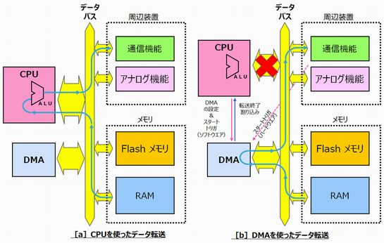

# 組み込み講座メモ

## 言語関係

### 割り込み

- degitalPinTointerrupt()
  - 関数は引数としてピンを取り、割り込みとして使える場合は同じピンを返します。例えば、ArduinoではUNOは動作しません。なぜなら、割り込みはピン2と3のみでサポートされているからです。

割り込みの利用
割り込みはマイクロコントローラプログラムで自動的に物事を起こすのに役立ち、タイミングの問題の解決にも役立ちます。割り込みの良い作業には、回転エンコーダの読み取りやユーザー入力の監視などがあります。

- interrupt:割り込みの数。許可されるデータ型:int
- pin:Arduinoのピン番号です。
- ISR割り込みが発生した際にISRを呼び出します。この関数はパラメータを受け取らず、何も返さなくてはなりません。この機能は時に割り込みサービスルーチンと呼ばれます。
- mode:は割り込みをいつトリガーすべきかを定義します。有効な値としてあらかじめ定義された4つの定数があります
- CHANGE:ピンの値が変わるたびに割り込みをトリガーします
ピンが低から高に変わったときにトリガーするRISEです。
ピンがハイからローに変わるときの落ち込み。
- Due ボード、ゼロボード、MKR1000ボードは以下のことも可能にしています

## 74HC595のピンとその機能

- SHcp: シフトレジスタの時系列入力。立ち上がりエッジでは、シフトレジスタ内のデータが逐次1ビットずつ移動します（例：Q1のデータがQ2に移動）。立ち下がりエッジでは、シフトレジスタ内のデータは変わりません。
- STcp: 記憶レジスタの時系列入力。立ち上がりエッジで、シフトレジスタ内のデータが記憶レジスタに移動します。
- DS: シリアルデータ入力ピン。

## その他

- volatile;気まぐれな、揮発性
- displayNumber()：この関数はデジタルチューブに数を表示します。74HC595シフトレジスタを通じてデジタルチューブに数を送信します
- shiftOut() は、DS(datapin10)を介して numbers[num] のバイトデータを1ビットずつシフトするために使用されます。 MSBFIRST は高ビットから移動することを意味します。
- abs関数：引数を絶対値にする。（intでつかう）
- First In First Out    FIFO  バッファー　受信したのをためといて先頭から取り出す
- Last In First Out　最後に入れたのを最初に取り出す

### serial monitor

- serial.print:シリアルモニターの出力。
- Serial.println:\nも込みで出力
- serial.bigin:シリアルモニターの初期化。

## Linux

元は大学の学習ツールだったが有用なので企業開発にも利用。

## ネットワークの基礎知識

- IP adress
デバイスの住所。これを参照してリクエストを送る
- IPV4/IPV6
IPv6とIPv4では、通信速度・容量の変化はまったくない
割り振られるIPアドレスは、IPv6の方が圧倒的に多い（実質無限）ので、プロバイダ側で割り振る時スムーズ
結果的に通信する時、プロバイダ側で混雑しないIPv6通信の方が夜間急激に遅くなることなどがない
（ネット利用が混み合う時間だとIP数が少ないIPv4の場合、IPを割り当てるのに時間がかかるから）
- tcp/udp
どちらも通信プロトコルを指す。tcpが正確重視なのに対して、udpはスピードを重視している。
- dns
ドメイン名をIPアドレスに変換する仕組み
- 無線LAN：ケーブルを使わずにパソコンとパソコンをつないで作ったネットワークのこと。
- Wi-Fi：そのようなケーブルを使わない通信をする際に使うルールの1つ。その特定のルールを守った通信は「Wi-Fi」と呼ばれる。

IPアドレス:ポート番号
住所:部屋番号

### wsl2

Windows Subsystem for Linux 2 の略称で，Windows上で Linux を仮想的に動かすことができるシステム環境のことを指す。

### docker

Docker（ドッカー）は、アプリケーションを「コンテナ」と呼ばれる単位でパッケージ化して実行するプラットフォーム

コンテナとは、アプリに必要なコード・設定・ライブラリ・OSパッケージなどを1つにまとめた“実行可能なパッケージ”

マイコン炊飯器
マイコンにはタイマーがあるので時間測定ができる

## ウォッチドッグタイマー

『マイコンを監視するタイマー』のこと。

## オーバーランエラー

受信バッファに取り込まれたデータをCPUまたはDMA（Direct Memory Access）が読み出さないうちに、次のデータを取り込んでしまい、前の受信データが失われることです。  
対策：割り込みの優先順位やバス権の優先順位を調整することで、オーバーランエラーの発生を防ぎます。

## チャタリング

電気的接点が物理的に閉／開する時に、この跳ね返りが原因で、機械的な弾性振動が発生します。これが乱雑な電気的パルスを発生させる。（パルス幅の前後にぐにゃぐにゃしたものがあったらパルス））

## マイコン

### 割り込みハンドラ

そもそも割り込みとはマイコンがメインルーティンの一連の処理を行っている時に、何かのきっかけ（イベント）でその処理を中断し、別のルーティンで別の処理を行うことです。そのイベントは割り込み要求と呼ばれています。

## DMA

通常、

## スタック

- スタック（Stack）積み重ねるという意味。
マイコンで言うスタックとはコンテキストを次々と積み重ねて保存することになります。すなわち、コンテキストがスタックに保存されるときにはSPで示されたアドレスから順次積み重ねるイメージで保存されます。「積み重ねる」と述べましたが、実際のマイコンでは、SPは減算され、アドレスの少ない方向に保存される場合が多いです。

## フォトレジスタ

10バイト使っているため、1023が最大値

## 時間

0900-12:00,13:00-18:00

## 本日の学習項目

- ポン
- スネーク
- シンプルWeb

## URL/Memo

[「電波が届きにくい」を解消　ミリ波とテラヘルツ波を自動切換え](https://eetimes.itmedia.co.jp/ee/articles/2605/29/news048.html)

## 感想/質問/その他(振り返り)

また皆さんに迷惑をかけてしまった。本当に申し訳ない。明日はシンプルなWebサーバーから。

## 残作業(あれば)
